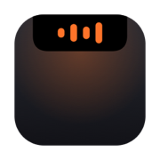
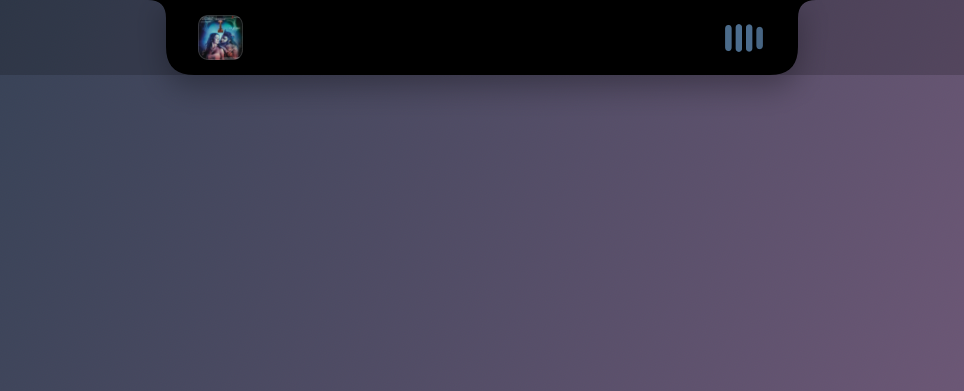
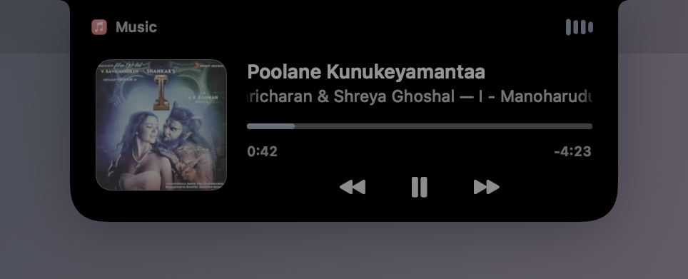
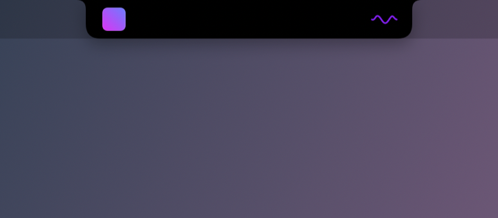
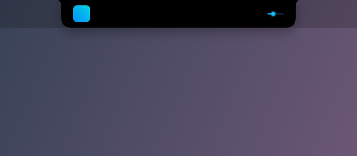
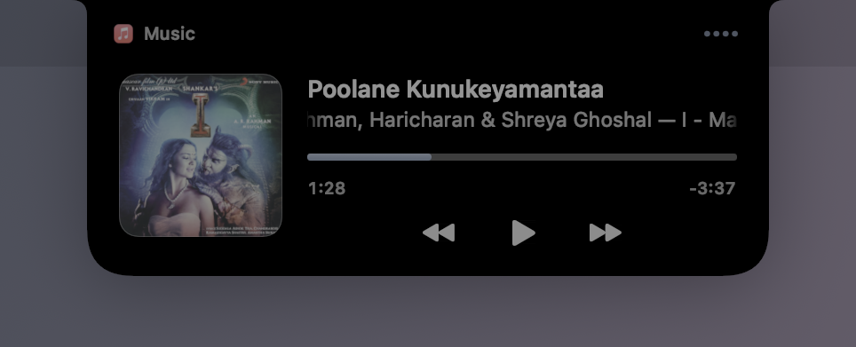

<div align="center">



# NotchIsland

**A Dynamic Island for the MacBook notch, for whatever is playing.**

Artwork to the left of the camera housing, an animation to the right that tells
you *what kind* of thing is playing, and a full mini player when you reach for
it.



</div>

---

## What it does

NotchIsland turns the notch into a media display. It works with anything that
publishes now-playing information to macOS — Apple Music, Spotify, Podcasts,
IINA, VLC, and anything playing in Safari, Chrome or Arc.

**At rest**, it sits in the menu bar strip: artwork on the left of the notch, an
activity indicator on the right, and nothing at all when nothing is playing.

**Hover the top of the screen** and it opens into a mini player.

<div align="center">

</div>

### The indicator knows what it is looking at

This is the part that is not just decoration. The right-hand animation differs
by content type, so a glance tells you whether that sound is a song, a video or
someone talking.

| | |
|---|---|
| **Music** — equaliser bars, each driven by two sine waves of different frequency so they drift rather than march |  |
| **Podcast** — a travelling waveform on a speech envelope, dropping close to silence between phrases |  |
| **Video** — the real playback position, as a track with a lit head |  |

macOS reports the media type directly for dedicated applications. Two cases
have to be worked out instead:

- **General-purpose players** — VLC, IINA, QuickTime, mpv — open albums as
  readily as films, so the application says nothing useful. The track decides:
  tagged with an artist or album and under fifteen minutes is music, anything
  longer or untagged is video.
- **Browsers** report no media type at all. A full set of artist and album tags
  is a streaming music service, something running past half an hour is an
  episode, and anything else is video.

### The mini player

Artwork, title and artist, a draggable progress bar with elapsed and remaining
time, and previous / play-pause / next. Long titles scroll. Dragging the
progress bar moves the playhead immediately and seeks the source on release,
rather than firing a seek command per pixel.

Playback that reports no duration — live radio, a stream — gets a static bar
rather than a progress bar implying a position that does not exist.

<div align="center">

</div>

## Requirements

- macOS 26 or later
- Apple silicon
- A MacBook with a notch

The island is only ever drawn on a built-in display that physically has a notch.
On an external monitor, or with the lid closed, nothing appears.

## Installing

Download the `.dmg` from [Releases](../../releases), open it, and drag
NotchIsland to Applications.

**The first launch needs a right-click.** The app is signed ad-hoc rather than
with a paid Developer ID, so Gatekeeper will not open it on a double-click.
Right-click the app → **Open** → **Open**. This is needed once.

Then open Settings from the menu bar icon and turn on **Launch at login**.

### Updates

The menu names the version you are running, and offers the new one when there
is one. Choosing it downloads the release, replaces the running copy and
relaunches into it.

Because the app is ad-hoc signed, there is no Developer ID for macOS to check
on relaunch — so every download is verified against the `SHA256SUMS.txt`
published beside it in the release, and one that does not match is discarded
rather than installed. Worth being clear-eyed about what that does and does
not buy you: it proves the download is the file that was published, and
nothing about who published it. Anyone able to publish a release to this
repository can ship code to every install. That is a property of shipping
without notarisation, not of this particular updater.

Turn automatic checking off in Settings if you would rather look yourself.

## Permissions

NotchIsland asks for as little as it can, and it should be obvious why each
one is wanted. **Everything here is optional** — refuse any of it and the app
keeps working, with the specific feature it buys missing.

| Permission | Asked when | What it is for | Without it |
|---|---|---|---|
| **Automation → Music** | The first time an Apple Music track's cover cannot be found any other way | Two things MediaRemote refuses to report: the artwork for tracks in your library, and where Music has actually got to after you drag its own scrubber | Library tracks show the Music icon instead of a cover, and the playhead can drift after you seek inside Music |
| **Login item** | You turn on *Launch at login* | Starts the app when you log in, through `SMAppService` | Start it yourself |

That is the whole list. In particular:

- **No Accessibility.** The pointer is watched with ordinary mouse-location
  reads, which need no permission. Nothing is clicked or typed on your behalf.
- **No Screen Recording.** Nothing is captured.
- **No Full Disk Access, and no access to your media files.** Album art for
  local files played in VLC is read from VLC's own cache in
  `~/Library/Caches`, precisely so the app never has to ask to read your
  Music, Downloads or Documents folders.
- **No network access, except to GitHub.** Two kinds of request are made:
  checking for and downloading releases, and fetching cover art from the URL
  the source application published for it (Apple Music's own image CDN, for
  instance). Nothing is sent anywhere — no analytics, no crash reporting, no
  account.
- **Nothing is injected into any other application.** The MediaRemote helper
  described below runs as its own process and touches nothing else.

## Settings

| Setting | What it does |
|---|---|
| Launch at login | Registers the app as a login item through `SMAppService`. |
| Show menu bar icon | The menu carries the version, updates, Settings and Quit. |
| Hide the island while paused | Off by default, so the island stays put when you pause. |
| Check for updates automatically | Looks for a new release on launch and every six hours. On by default. |

### About the menu bar

The island is wider than the notch — that is where the artwork and the indicator
go — so it can cover whatever sits in the menu bar beside the notch.

Nothing can be done about that from inside an app, and an earlier version of
this one made it worse by trying. Control Center's own items cannot be moved at
all; other applications' status icons are laid out as one group anchored to the
right edge, so adding an invisible spacer only widens that group leftwards and
pushes their icons *towards* the island. That reservation was measured and
removed in v0.17.1. NotchIsland now occupies its own icon and nothing more.

If the overlap bothers you, the island's reach either side of the notch is one
constant: `IslandLayout.compactSideWidth`.

## How it works

Reading what is playing system-wide means MediaRemote, a private framework. As
of macOS 15.4, `mediaremoted` only answers those queries for processes whose
main executable is signed by Apple. An ordinary application gets a callback with
an empty dictionary — no error, no denial, just nothing. This was verified on
macOS 27.0 before a line of this app was written.

The check looks at the *process*, not at what the process has loaded. So
NotchIsland ships a small dynamic library and runs it inside `/usr/bin/perl`,
which Apple signs:

```
NotchIsland  ──spawns──▶  /usr/bin/perl  ──loads──▶  libNotchMediaBridge.dylib
     ▲                                                        │
     └──────────── newline-delimited JSON over a pipe ─────────┘
```

The library's constructor takes the host process over and never returns. It
streams now-playing state out as JSON and reads transport commands back in. It
needs no permissions of any kind, and nothing is injected into any other
application.

What MediaRemote will not give up is artwork bytes, and a seek you made in the
source's own window. Those are asked of the source application directly, which
is the one and only reason the app ever wants Automation. See
[Permissions](#permissions), and [TECHNICAL.md](TECHNICAL.md) for what was
measured to establish it.

The helper exits about a second after the app does. It polls its parent to
decide that, because its own stdin never reaches EOF: the write end of that pipe
stays open inside the helper itself, and neither a process-exit source nor
reparenting to launchd proved reliable enough to depend on.

### Notch geometry

The notch is measured from the display at runtime rather than looked up from a
table of Mac models — every notched Mac reports the areas either side of its
camera housing, which makes this exact on models that do not exist yet. The
island is symmetric about the housing by construction and centred on the
housing rather than on the screen.

### Further in

[**TECHNICAL.md**](TECHNICAL.md) covers the whole of it: the process model, what
MediaRemote will and will not answer and how that was established, how artwork
is resolved per source, the geometry, the updater, and how each piece was
verified on a machine that could not screenshot its own window.

## Building

Only the Command Line Tools are needed; Xcode is not.

```sh
swift build                 # build
./Scripts/test.sh           # run the tests
./Scripts/build-app.sh      # assemble dist/NotchIsland.app
./Scripts/make-dmg.sh       # package dist/NotchIsland-<version>.dmg
```

To sign with a real identity, set `DEVELOPER_ID_APPLICATION` before building:

```sh
export DEVELOPER_ID_APPLICATION="Developer ID Application: Your Name (TEAMID)"
./Scripts/build-app.sh
```

### Development

```sh
./Scripts/install-hooks.sh                      # formatting, build and tests before each commit
.build/debug/NotchIsland --simulate-playback    # island without commandeering your audio
.build/debug/NotchIsland --render-previews /tmp/previews   # render the island to PNG
```

Both flags are debug-only and compiled out of release builds. They exist because
capturing a floating panel needs screen-recording permission, which makes the UI
awkward to inspect any other way.

Note that view-local state lives in `@Observable` models rather than `@State`:
`@State` became a macro in the macOS 27 SDK and its plugin ships only with
Xcode, not with the Command Line Tools.

## Contributing

Commit subjects are the version the commit brings the project to — `v0.4.0`,
`v1.0.0` — with the explanation in the body. The `commit-msg` hook enforces it,
and `CHANGELOG.md` is kept up to date alongside.

## License

MIT. See [LICENSE](LICENSE).
